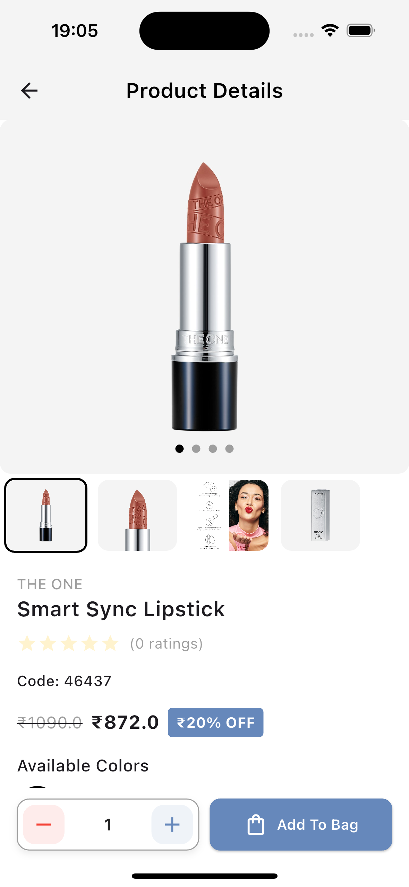
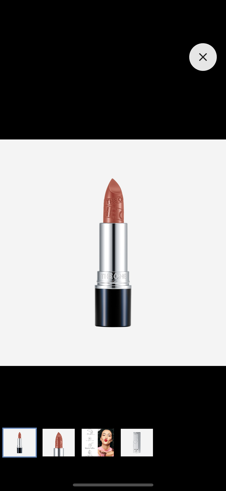
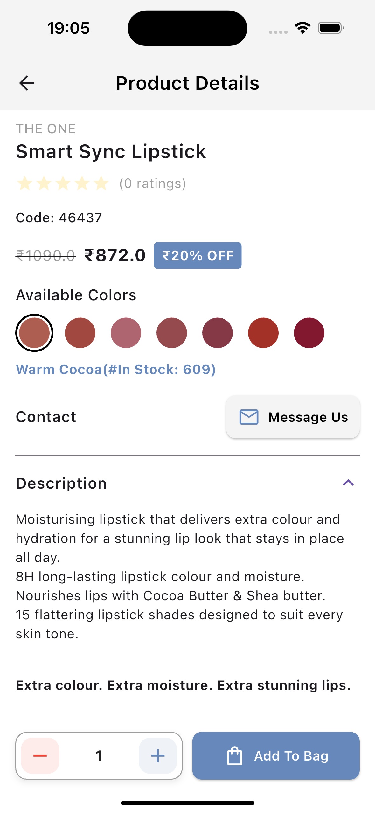
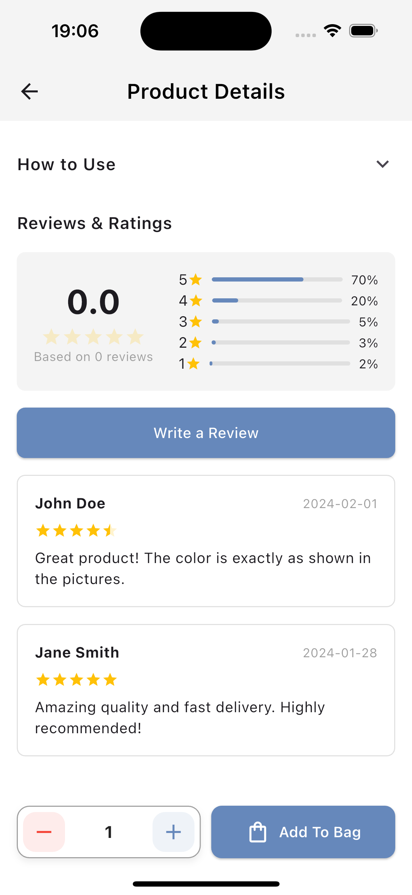

# Flutter Product Details App

A modern Flutter e-commerce product details page with GetX state management. This app demonstrates best practices for building scalable Flutter applications with clean architecture. You can find the installation apk inside apk folder for testing purpose.



## Features

- 🎨 Dynamic color variant selection
- 💰 Variant-specific pricing
- 🛒 Quantity management with min/max order limits
- 📸 Image gallery with full-screen view
- ⭐ Product reviews and ratings
- 💬 Contact seller functionality
- 🎯 GetX state management
- 🏗️ Clean architecture

## Screenshots

### Product Gallery


### Color Variants


### Product Reviews


## Project Structure

```
lib/
├── main.dart
├── app/
│   ├── data/
│   │   ├── models/
│   │   │   ├── product_model.dart
│   │   │   └── review_model.dart
│   │   ├── providers/
│   │   │   └── product_provider.dart
│   │   └── repositories/
│   │       └── product_repository.dart
│   ├── modules/
│   │   └── product_details/
│   │       ├── bindings/
│   │       │   └── product_binding.dart
│   │       ├── controllers/
│   │       │   └── product_controller.dart
│   │       └── views/
│   │           ├── widgets/
│   │           │   ├── image_gallery.dart
│   │           │   ├── product_actions.dart
│   │           │   └── product_details_loading.dart
│   │           │   ├── product_info.dart
│   │           │   └── review_section.dart
│   │           ├── components/
│   │           │   ├── add_review_dialog.dart
│   │           │   └── contact_seller_dialog.dart
│   │           └── product_details_view.dart
│   ├── core/
│   │   ├── values/
│   │   │   └── app_colors.dart
│   │   ├── theme/
│   │   │   └── app_theme.dart
│   │   ├── widgets/
│   │   │   └── shimmer_loading.dart
│   │   └── utils/
│   │       └── helpers.dart
│   └── routes/
│       └── app_pages.dart
└── config.dart
```

## Prerequisites

- Flutter SDK (>=3.24.3)
- Dart SDK (>=3.5.3)
- An IDE (VS Code, Android Studio, or IntelliJ)

## Dependencies

```yaml
dependencies:
  flutter:
    sdk: flutter
  cupertino_icons: ^1.0.8
  cached_network_image: ^3.4.1
  http: ^1.3.0
  flutter_widget_from_html: ^0.15.3
  flutter_rating_bar: ^4.0.1
  get: ^4.6.6
  shimmer: ^3.0.0
  flutter_local_notifications: ^18.0.1
  permission_handler: ^11.3.1
```

## Installation

1. Clone the repository
```bash
git clone https://github.com/regmiprabesh/flutter-product-details.git
```

2. Navigate to the project directory
```bash
cd flutter-product-details
```

3. Install dependencies
```bash
flutter pub get
```

4. Run the app
```bash
flutter run
```

## Configuration

1. Update the API endpoint in `lib/app/core/values/app_constants.dart`:
```dart
class AppConstants {
  static const String baseUrl = 'YOUR_API_BASE_URL';
  // ... other constants
}
```

## Theme Customization

The app uses a customizable theme system. Update the theme in `lib/app/core/values/app_theme.dart`:

```dart
ThemeData appTheme = ThemeData(
  primaryColor: AppColors.primary,
  // ... other theme properties
);
```

## API Response Structure

Example of the expected product API response:

```json
{
  "title": "Product",
  "message": "Successfully got detail",
  "data": {
    "_id": "66a8de6c6c00fd9729efeed4",
    "slug": "smart-sync-lipstick-233",
    "category": {
      "_id": "63ef0d3fb6e3dd3446935839",
      "slug": "lipstick-74",
      "title": "Lipstick",
      "level": 2,
      "parentId": "63ee106fb6e3dd34469354ae"
    },
    "brand": {
      "_id": "63e23a7e43774e3b0053067a",
      "slug": "the-one-20",
      "name": "THE ONE"
    },
    "title": "Smart Sync Lipstick",
    "ingredient": "\u003Cp\u003ELip Response Technology is a blend of nourishing&nbsp;\u003Cstrong\u003EShea\u003C/strong\u003E&nbsp;and&nbsp;\u003Cstrong\u003ECocoa Butter\u003C/strong\u003E&nbsp;rich in essential fatty acids like the skin’s own oils, making them particularly effective as moisturisers.\u003Cbr\u003E\u003C/p\u003E\u003Cp\u003EIt forms a protective moisture barrier on the lips that helps to slow potential moisture loss and protects natural moisture that is already in the lips.\u003Cbr\u003E\u003C/p\u003E\u003Cp\u003EThen&nbsp;\u003Cstrong\u003Elocks in moisture for up to 8H\u003C/strong\u003E&nbsp;for all-day hydrated lips!\u003Cbr\u003E\u003C/p\u003E\u003Cdiv style=\"text-align: left\"\u003E\u003Cstrong\u003EFormulated with Lip Response Technology designed to sync with your lips’ moisture needs for smart, personalised hydration!\u003C/strong\u003E\u003Cbr\u003E\u003Cbr\u003E\u003Cbr\u003E\u003Cstrong\u003EHow does Lip Response Technology work?\u003C/strong\u003E\u003Cbr\u003E\u003Cbr\u003E\u003Cul\u003E\u003Cli\u003EIf you have&nbsp;\u003Cstrong\u003Ehydrated lips\u003C/strong\u003E, it acts as a&nbsp;\u003Cstrong\u003EMOISTURE BOOSTER\u003C/strong\u003E.\u003Cbr\u003E\u003C/li\u003E\u003C/ul\u003E\u003Cbr\u003E\u003Cul\u003E\u003Cli\u003EIf you have&nbsp;\u003Cstrong\u003Edry lips\u003C/strong\u003E, it&nbsp;\u003Cstrong\u003EREPLENISHES MOISTURE\u003C/strong\u003E.\u003Cbr\u003E\u003C/li\u003E\u003C/ul\u003E\u003Cbr\u003E\u003Cbr\u003E\u003Cstrong\u003ETip:\u003C/strong\u003E&nbsp;Even if your lips regularly feel moisturised, it is important to&nbsp;\u003Cstrong\u003Eboost moisture\u003C/strong\u003E&nbsp;regularly to reduce susceptibility to dryness.\u003Cbr\u003E\u003Cbr\u003E\u003C/div\u003E\u003Cdiv\u003EAll ingredients\u003C/div\u003E\u003Cdiv\u003EOCTYLDODECANOL, RICINUS COMMUNIS SEED OIL, DIISOSTEARYL DIMER DILINOLEATE, SYNTHETIC WAX, SILICA, CAPRYLIC/CAPRIC TRIGLYCERIDE, MICA, COPERNICIA CERIFERA CERA, CERA MICROCRISTALLINA, HELIANTHUS ANNUUS SEED CERA, ISOPROPYL LANOLATE, HYDROGENATED VEGETABLE OIL, PENTAERYTHRITYL TETRACAPRYLATE/TETRACAPRATE, BUTYROSPERMUM PARKII BUTTER, THEOBROMA CACAO SEED BUTTER, PARFUM, SHOREA ROBUSTA RESIN, ETHYLHEXYLGLYCERIN, RHUS VERNICIFLUA PEEL CERA, GLYCERYL CAPRYLATE, TOCOPHERYL ACETATE, GLYCERIN, CAPRYLHYDROXAMIC ACID, PENTAERYTHRITYL TETRA-DI-T-BUTYL HYDROXYHYDROCINNAMATE, TOCOPHEROL, ASCORBYL PALMITATE, CITRIC ACID, +/-: CI 77891, CI 77492, CI 15850, CI 77491, CI 77499, CI 45410, CI 42090, CI 19140\u003C/div\u003E",
    "howToUse": "\u003Cp\u003E​\u003Cspan style=\"font-size: 14.112px\"\u003EApply directly to bare lips. Begin application in the centre of the cupids bow, moving outwards towards the edges. Swipe across your bottom lip to complete your look.\u003C/span\u003E​\u003Cbr\u003E\u003C/p\u003E",
    "description": "\u003Cdiv\u003EMoisturising lipstick that delivers extra colour and hydration for a stunning lip look that stays in place all day.\u003C/div\u003E\u003Cdiv\u003E8H long-lasting lipstick colour and moisture.\u003C/div\u003E\u003Cdiv\u003ENourishes lips with Cocoa Butter &amp; Shea butter.\u003C/div\u003E\u003Cdiv\u003E15 flattering lipstick shades designed to suit every skin tone.\u003Cbr\u003E\u003Cbr\u003E\u003C/div\u003E\u003Cp\u003E\u003Cstrong\u003EExtra colour. Extra moisture. Extra stunning lips.\u003C/strong\u003E\u003Cbr\u003E\u003Cbr\u003E\u003C/p\u003E\u003Cp\u003EEnjoy a lip look that is guaranteed to make an impact with The ONE Smart Sync Lipstick! This creamy,&nbsp;\u003Cstrong\u003Emoisturising lipstick\u003C/strong\u003E&nbsp;delivers stunning,&nbsp;\u003Cstrong\u003Eintense lip colour\u003C/strong\u003E&nbsp;and&nbsp;\u003Cstrong\u003Ecomforting moisture\u003C/strong\u003E&nbsp;that lasts all day.\u003Cbr\u003E\u003C/p\u003E\u003Cp\u003EFormulated with Lip Response Technology designed to sync with your lips’ moisture needs to keep your lips comfortable and&nbsp;\u003Cstrong\u003Emoisturised all day!\u003C/strong\u003E\u003Cbr\u003E\u003C/p\u003E\u003Cp\u003E\u003Cbr\u003E\u003C/p\u003E\u003Cul\u003E\u003Cli\u003E\u003Cstrong\u003E8H long-lasting\u003C/strong\u003E&nbsp;colour and moisture.\u003Cbr\u003E\u003C/li\u003E\u003Cli\u003ENourishes lips with Lip Response Technology: a blend of&nbsp;\u003Cstrong\u003ECocoa butter and Shea Butter\u003C/strong\u003E.\u003Cbr\u003E\u003C/li\u003E\u003Cli\u003E\u003Cstrong\u003EIntense Colour Pigments\u003C/strong\u003E&nbsp;for gorgeous, vibrant colour.\u003Cbr\u003E\u003C/li\u003E\u003Cli\u003ELocks in and replenishes moisture for&nbsp;\u003Cstrong\u003Eall-day moisturised lips!*\u003C/strong\u003E\u003Cbr\u003E\u003C/li\u003E\u003Cli\u003E\u003Cstrong\u003EFull coverage\u003C/strong\u003E&nbsp;in one swipe.\u003Cbr\u003E\u003C/li\u003E\u003Cli\u003E\u003Cstrong\u003E15 flattering lipstick shades\u003C/strong\u003E&nbsp;that suit every skin tone.\u003Cbr\u003E\u003C/li\u003E\u003C/ul\u003E\u003Cp\u003E*Consumer tested.\u003C/p\u003E",
    "price": 872,
    "rewardPoint": 5,
    "commissionPercentage": 5,
    "strikePrice": 1090,
    "offPercent": 20,
    "minOrder": 0,
    "maxOrder": 0,
    "status": false,
    "images": [
      "https://image1.jpeg",
      "https://image2.jpeg",
      "https://image3.webp",
      "https://image4.jpeg"
    ],
    "colorAttributes": [
      {
        "_id": "66a8b9486c00fd9729efe2cf",
        "isTwin": false,
        "name": "Warm Cocoa",
        "colorValue": [
          "#ae5e51"
        ]
      },
      {
        "_id": "66a8b9926c00fd9729efe2f0",
        "isTwin": false,
        "name": "Baked Terracotta",
        "colorValue": [
          "#a14940"
        ]
      },
      {
        "_id": "66a8b9b96c00fd9729efe301",
        "isTwin": false,
        "name": "Pinkish Mauve",
        "colorValue": [
          "#af656f"
        ]
      },
      {
        "_id": "66a8c5ad6c00fd9729efe6b0",
        "isTwin": false,
        "name": "Marvellous Mocha",
        "colorValue": [
          "#954a4d"
        ]
      },
      {
        "_id": "66a8c5d56c00fd9729efe6c1",
        "isTwin": false,
        "name": "Deep Berry",
        "colorValue": [
          "#853846"
        ]
      },
      {
        "_id": "66a8c62d6c00fd9729efe6d2",
        "isTwin": false,
        "name": "Stylish Brick",
        "colorValue": [
          "#a43127"
        ]
      },
      {
        "_id": "66a8c6436c00fd9729efe6e3",
        "isTwin": false,
        "name": "Cherry Plum",
        "colorValue": [
          "#811830"
        ]
      }
    ],
    "sizeAttributes": [],
    "variantType": "Color",
    "colorVariants": [
      {
        "color": {
          "_id": "66a8b9486c00fd9729efe2cf",
          "isTwin": false,
          "name": "Warm Cocoa",
          "colorValue": [
            "#ae5e51"
          ]
        },
        "price": 872,
        "rewardPoint": 5,
        "strikePrice": 1090,
        "offPercent": 20,
        "minOrder": 1,
        "maxOrder": 609,
        "status": true,
        "images": [],
        "productCode": "46437",
        "_id": "678529433363de357ef6a620"
      },
      {
        "color": {
          "_id": "66a8b9926c00fd9729efe2f0",
          "isTwin": false,
          "name": "Baked Terracotta",
          "colorValue": [
            "#a14940"
          ]
        },
        "price": 872,
        "rewardPoint": 5,
        "strikePrice": 1090,
        "offPercent": 20,
        "minOrder": 1,
        "maxOrder": 607,
        "status": true,
        "images": [],
        "productCode": "46438",
        "_id": "678529433363de357ef6a621"
      },
      {
        "color": {
          "_id": "66a8b9b96c00fd9729efe301",
          "isTwin": false,
          "name": "Pinkish Mauve",
          "colorValue": [
            "#af656f"
          ]
        },
        "price": 872,
        "rewardPoint": 5,
        "strikePrice": 1090,
        "offPercent": 20,
        "minOrder": 1,
        "maxOrder": 615,
        "status": true,
        "images": [],
        "productCode": "46439",
        "_id": "678529433363de357ef6a622"
      },
      {
        "color": {
          "_id": "66a8c5ad6c00fd9729efe6b0",
          "isTwin": false,
          "name": "Marvellous Mocha",
          "colorValue": [
            "#954a4d"
          ]
        },
        "price": 872,
        "rewardPoint": 5,
        "strikePrice": 1090,
        "offPercent": 20,
        "minOrder": 1,
        "maxOrder": 619,
        "status": true,
        "images": [],
        "productCode": "46443",
        "_id": "678529433363de357ef6a623"
      },
      {
        "color": {
          "_id": "66a8c5d56c00fd9729efe6c1",
          "isTwin": false,
          "name": "Deep Berry",
          "colorValue": [
            "#853846"
          ]
        },
        "price": 872,
        "rewardPoint": 5,
        "strikePrice": 1090,
        "offPercent": 20,
        "minOrder": 1,
        "maxOrder": 644,
        "status": true,
        "images": [],
        "productCode": "46446",
        "_id": "678529433363de357ef6a624"
      },
      {
        "color": {
          "_id": "66a8c62d6c00fd9729efe6d2",
          "isTwin": false,
          "name": "Stylish Brick",
          "colorValue": [
            "#a43127"
          ]
        },
        "price": 872,
        "rewardPoint": 5,
        "strikePrice": 1090,
        "offPercent": 20,
        "minOrder": 1,
        "maxOrder": 639,
        "status": true,
        "images": [],
        "productCode": "46448",
        "_id": "678529433363de357ef6a625"
      },
      {
        "color": {
          "_id": "66a8c6436c00fd9729efe6e3",
          "isTwin": false,
          "name": "Cherry Plum",
          "colorValue": [
            "#811830"
          ]
        },
        "price": 872,
        "rewardPoint": 5,
        "strikePrice": 1090,
        "offPercent": 20,
        "minOrder": 1,
        "maxOrder": 591,
        "status": true,
        "images": [],
        "productCode": "46449",
        "_id": "678529433363de357ef6a626"
      }
    ],
    "ratings": 0,
    "totalRatings": 0,
    "ratedBy": 0,
    "filterOptions": {
      "age_12": false,
      "age_20": false,
      "age_30": false,
      "age_40": false,
      "age_50": false,
      "benefits_anti_ageing": false,
      "benefits_anti_shine": false,
      "benefits_brightning": false,
      "benefits_bronzing": false,
      "benefits_cooling": false,
      "benefits_concealing": false,
      "benefits_conditioning": false,
      "benefits_curling": false,
      "benefits_defining": false,
      "benefits_energising": false,
      "benefits_even_skin_tone": false,
      "benefits_exfoliating": false,
      "benefits_filling": false,
      "benefits_growth_boosting": false,
      "benefits_hydrating": false,
      "benefits_lengthening": false,
      "benefits_long_lasting": false,
      "benefits_mattifing": false,
      "benefits_moisturing": false,
      "benefits_nourishing": false,
      "benefits_protecting": false,
      "benefits_quick_dry": false,
      "benefits_revitalising": false,
      "benefits_sculpting": false,
      "benefits_smoothing": false,
      "benefits_thickening": false,
      "benefits_transfer_proof": false,
      "benefits_volumising": false,
      "benefits_waterproof": false,
      "color_red": false,
      "color_red_hex": "#FF0000",
      "color_blue": false,
      "color_blue_hex": "#0000FF",
      "color_pink": false,
      "color_pink_hex": "#FFC0CB",
      "color_black": false,
      "color_black_hex": "#000000",
      "color_brown": false,
      "color_brown_hex": "#A52A2A",
      "color_grey": false,
      "color_grey_hex": "#808080",
      "color_green": false,
      "color_green_hex": "#008000",
      "color_burgundy": false,
      "color_burgundy_hex": "#800020",
      "color_purple": false,
      "color_purple_hex": "#800080",
      "coverage_high": false,
      "coverage_light": false,
      "coverage_medium": false,
      "finish_creamy": false,
      "finish_glossy": false,
      "finish_luminious": false,
      "finish_malte": false,
      "finish_metaallic": false,
      "finish_natural": false,
      "finish_satin": false,
      "finish_sheer": false,
      "finish_shimmer": false,
      "finish_shine": false,
      "formulation_gel": false,
      "formulation_liquid": false,
      "formulation_pencil": false,
      "formulation_powder": false,
      "formulation_stick": false,
      "formulation_wax": false,
      "formulation_cream": false,
      "formulation_lip_balm": false,
      "formulation_loose": false,
      "formulation_pearls": false,
      "formulation_pressed": false,
      "formulation_serum": false,
      "skin_type_combination": false,
      "skin_type_dry": false,
      "skin_type_normal": false,
      "skin_type_oily": false,
      "skin_type_sensitive": false
    },
    "metaRobots": "noindex,nofollow",
    "isTodaysDeal": true,
    "isFeatured": true,
    "isPublished": true,
    "searchWords": "46437 46438 46439 46443 46446 46448 46449",
    "isDeleted": false,
    "sizeVariants": [],
    "createdAt": "2024-07-30T12:37:00.897Z",
    "updatedAt": "2025-01-13T14:54:59.603Z",
    "__v": 0,
    "noneText": "",
    "breadCrums": [
      {
        "title": "Make-up",
        "slug": "make-up-32"
      },
      {
        "title": "Lips",
        "slug": "lips-35"
      },
      {
        "title": "Lipstick",
        "slug": "lipstick-74"
      }
    ],
    "wished": false
  }
}
```

## Contributing

1. Fork the repository
2. Create your feature branch (`git checkout -b feature/amazing-feature`)
3. Commit your changes (`git commit -m 'Add some amazing feature'`)
4. Push to the branch (`git push origin feature/amazing-feature`)
5. Open a Pull Request

## License

This project is licensed under the MIT License - see the [LICENSE](LICENSE) file for details.

## Acknowledgments

- GetX for state management
- Flutter team for the amazing framework

## Contact

[Prabesh Regmi - Visit Me](https://www.prabeshregmi.com.np)

Project Link: [https://github.com/regmiprabesh/flutter-product-details](https://github.com/regmiprabesh/flutter-product-details)